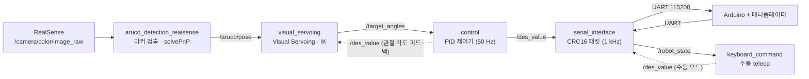

# 2-Link Manipulator Visual Servoing

RealSense 카메라와 ArUco 마커를 이용해 **2-link 평면 매니퓰레이터가 목표 마커를 실시간으로 추종**하도록 만든 ROS 2 시스템입니다.
인식 → 기구학 → 제어 → 하드웨어 통신까지 전 구간을 직접 구현했습니다.

> 로봇 프로그래밍 (ROB4008 이론 / ROB4009 실습) · 2025-2 · 개인 프로젝트

---

## 1. 개요

| 항목 | 내용 |
|---|---|
| 목표 | 엔드이펙터에 장착된 카메라(eye-in-hand)로 ArUco 마커를 검출하고, 마커와 일정 거리를 유지하며 추종 |
| 로봇 | 2-link 평면 매니퓰레이터 (L1 = 143 mm, L2 = 102 mm) |
| 센서 | Intel RealSense RGB 카메라 |
| 프레임워크 | ROS 2 (rclpy), OpenCV, Arduino |
| 제어 주기 | 제어 루프 50 Hz / 시리얼 통신 1 kHz |

---

## 2. 시스템 구조



### 노드 구성

| 노드 | 파일 | 구독 | 발행 |
|---|---|---|---|
| `aruco_detector_node_realsense` | [`marker_detection/aruco_detection_realsense.py`](marker_detection/aruco_detection_realsense.py) | `/camera/camera/color/image_raw`, `/camera/camera/color/camera_info` | `/aruco/pose`, `/aruco/image` |
| `visual_servoing_node` | [`marker_detection/visual_servoing.py`](marker_detection/visual_servoing.py) | `/aruco/pose`, `/des_value` | `/target_angles` |
| `robot_driver` | [`twolink_control/robot_driver.py`](twolink_control/robot_driver.py) | `/target_angles` | `/des_value` |
| `serial_interface` | [`twolink_control/serial_interface.py`](twolink_control/serial_interface.py) | `/des_value` | `/robot_state` |
| `keyboard_command` | [`twolink_control/keyboard_command.py`](twolink_control/keyboard_command.py) | `/robot_state` | `/des_value` |

커스텀 메시지 `twolink_msgs` — `CMD`(xdes, ydes, q1des, q2des), `XYpos`(위치·속도·관절각·관절속도 8필드)

---

## 3. 핵심 구현

### 3.1 마커 검출 — 검출 실패 구간의 Optical Flow 보간

`DICT_6X6_50` 딕셔너리, 마커 한 변 60 mm 기준으로 6-DoF 자세를 추정합니다.
`estimatePoseSingleMarkers`가 최신 OpenCV에서 제거된 점을 고려해, 마커 코너 4점의 object point를 직접 정의하고 `solvePnP`를 호출하는 방식으로 대체 구현했습니다.

빠른 움직임이나 모션 블러로 검출이 끊기면 제어 목표가 사라져 로봇이 멈추는 문제가 있었습니다. 다음과 같이 완화했습니다.

- **검출 파라미터 튜닝** — adaptive threshold 윈도우를 3~23으로 확장하고, `CORNER_REFINE_SUBPIX`로 코너를 서브픽셀 정밀도까지 보정
- **Lucas-Kanade Optical Flow 폴백** — 검출이 실패하면 직전 프레임의 코너 4점을 `calcOpticalFlowPyrLK`(winSize 21×21, 3-레벨 피라미드)로 추적하고, 4점이 모두 유효할 때만 그 코너로 다시 `solvePnP`를 수행해 자세 발행을 이어감
- **연산 부하 분리** — 자세(`/aruco/pose`)는 매 프레임 발행하되 시각화 이미지는 5프레임마다 발행. 구독 QoS는 `best_effort`(sensor data)로 두어 지연을 낮춤

### 3.2 역기구학 — 가상 링크와 해 선택

마커에서 `D_MAINTAIN`(400 mm)만큼 떨어진 지점을 유지하는 것이 목표이므로, **두 번째 링크가 `L2 + 유지거리`만큼 길다고 가정하는 가상 링크(virtual link) 기법**을 사용했습니다. 그러면 "마커 앞 400 mm 지점으로 가라"는 문제가 "가상 엔드이펙터를 마커 위치에 두어라"는 일반적인 IK 문제로 환원됩니다.

카메라 좌표계(X: 우, Y: 하, Z: 전방)의 관측값을, 순기구학으로 구한 엔드이펙터 자세 `φ = q1 + q2`만큼 회전시켜 마커의 전역 좌표를 추정합니다.

```
marker_x = x_ee + (z_cam·cos φ + x_cam·sin φ)
marker_y = y_ee + (z_cam·sin φ − x_cam·cos φ)
```

코사인 법칙으로 얻는 두 해(elbow-up / elbow-down) 중에서는 **현재 각도로부터의 이동량을 비용으로 계산해 최소인 쪽**을 선택합니다. 다만 비용만으로 고르면 두 해의 비용이 비슷한 구간에서 팔꿈치가 매 프레임 뒤집히는 채터링이 발생했습니다. 현재 `q2`의 부호와 반대되는 해에 **+100의 페널티를 부여하는 히스테리시스**를 넣어 이를 막았습니다.

도달 불가능한 목표(`|cos q2| > 1`)는 예외로 처리하고, 목표가 작업 공간 밖으로 멀어진 경우는 팔을 최대로 편 자세로 폴백합니다.

### 3.3 마커 상실 시 탐색 모드

일정 시간 이상 마커가 들어오지 않으면 탐색 모드로 진입해, `q2`를 3초 간격으로 90°씩 최대 4회 회전시키며 주변을 훑습니다. 마커가 다시 잡히면 즉시 탐색을 중단하고 서보잉으로 복귀합니다. 추종 대상이 시야를 벗어나도 사람의 개입 없이 회복됩니다.

### 3.4 PID 제어기

50 Hz 주기로 각 관절의 목표 속도를 계산합니다 (`kp = 1.0, ki = 0.0, kd = 0.01`).

- **Anti-windup** — 적분항을 ±1.0으로 클램핑해, 목표에 도달하지 못하는 구간에서 적분이 폭주하지 않도록 처리
- **속도 제한** — 출력을 관절별 최대 속도(q1: 0.7, q2: 1.0)로 포화시켜 하드웨어 급가속 방지
- 계산된 속도를 적분해 위치 명령으로 변환한 뒤 발행

### 3.5 시리얼 프로토콜

Arduino와의 통신은 1 kHz 주기 커스텀 바이너리 프로토콜로 처리합니다.

```
[0xAA][length=32][float32 × 8 = 32 bytes][CRC16 2 bytes]   총 36 bytes
```

- **송수신 분리** — 수신은 별도 스레드에서 버퍼에 누적하며 STX(`0xAA`) 기준으로 프레임을 정렬. 헤더가 깨지면 1바이트씩 버리며 재동기화
- **무결성 검증** — CRC16(Modbus, 다항식 `0xA001`) 불일치 시 해당 패킷을 폐기
- **락 보호** — 수신 스레드와 발행 타이머가 공유하는 최신 상태값을 `threading.Lock`으로 보호

---

## 4. 실행 방법

```bash
# 1. RealSense 드라이버
ros2 launch realsense2_camera rs_launch.py

# 2. 마커 검출
python3 marker_detection/aruco_detection_realsense.py

# 3. 비주얼 서보잉 (IK)
python3 marker_detection/visual_servoing.py

# 4. PID 제어기
python3 twolink_control/robot_driver.py

# 5. 하드웨어 인터페이스 (/dev/ttyACM0, 115200 baud)
python3 twolink_control/serial_interface.py
```

수동 조작이 필요하면 3·4번 대신 `keyboard_command.py`를 실행합니다 (`e`/`d`: q1 ±, `r`/`f`: q2 ±).

**요구사항** — ROS 2, `rclpy`, `opencv-python`(ArUco 포함), `cv_bridge`, `scipy`, `pyserial`, `twolink_msgs` 커스텀 메시지 패키지

---

## 5. 저장소 구성

```
marker_detection/
  aruco_detection_realsense.py   마커 검출 (aruco_detector_node_realsense)
  visual_servoing.py             비주얼 서보잉 · 역기구학 (visual_servoing_node)
twolink_control/
  robot_driver.py                PID 제어기 (robot_driver)
  serial_interface.py            하드웨어 시리얼 인터페이스 (serial_interface)
  keyboard_command.py            수동 teleop (keyboard_command)
archive/                         실습 중 거쳐 간 이전 반복본 (참고용, 실행 대상 아님)
lecture_note/                    강의 자료 (ROB4008 이론, ROB4009 실습)
```

각 파일명은 해당 ROS 2 노드명과 일치합니다. `archive/`에는 최종본에 이르기까지 거쳐 간 이전 버전들을 남겨 두었습니다 — 초기 서보잉 구현, 탐색 모드 추가 전의 기구학 버전, PID 도입 전의 제어기 등입니다.

---

## 6. 한계 및 개선 방향

- 현재 제어기는 하드웨어 엔코더 값이 아니라 **내부 적분값을 현재 위치로 사용**합니다. `/robot_state`로 들어오는 실제 관절각을 피드백에 반영하면 정상상태 오차를 줄일 수 있습니다.
- 저역통과 필터 계수가 `alpha = 1.0`으로 설정되어 있어 실질적으로 비활성 상태입니다. 마커 자세에 노이즈가 클 때는 계수를 낮춰 목표 각도의 급변을 억제할 여지가 있습니다.
- 적분 게인이 0이라 실질적으로 PD 제어로 동작합니다. Anti-windup은 이미 구현해 두었으므로 `ki` 도입을 통한 정상상태 오차 개선이 다음 단계입니다.
- ROS 2 패키지(`package.xml`, `setup.py`, launch 파일) 형태로 정리하면 5개 노드를 한 번에 실행할 수 있습니다.
